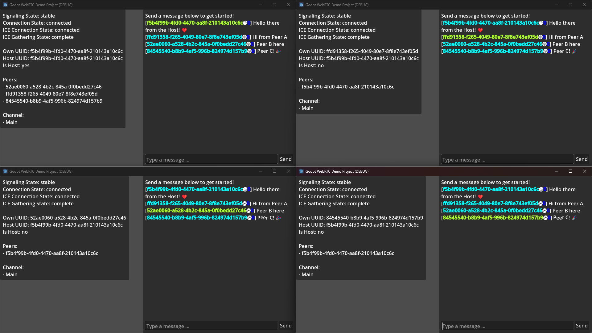

# Demo: Chat

The chat demo is a very simple chatting client.

## Flow

Both clients initialize and send a request packet to the Match Maker server.  
Once the room is filled, a connection is established between host and clients.

Once a channel is opened, messages can be send.  
Simply write some message into the text box and press the send button.

The message will be send to the host (or if we typed on the host: is internally forwarded to the host as a virtual incoming package) and processed there.  
If the message did arrive, the host will inform each peer about the new message and any info related to it, like what peer it came from.

Once a peer receives this new message packet, the message is added to the chat log and can be seen by the user.  
This is done to avoid messages from getting lost as there is some actual feedback.  
Messages aren't directly visible in the chat window, but need to arrive at the host first.
