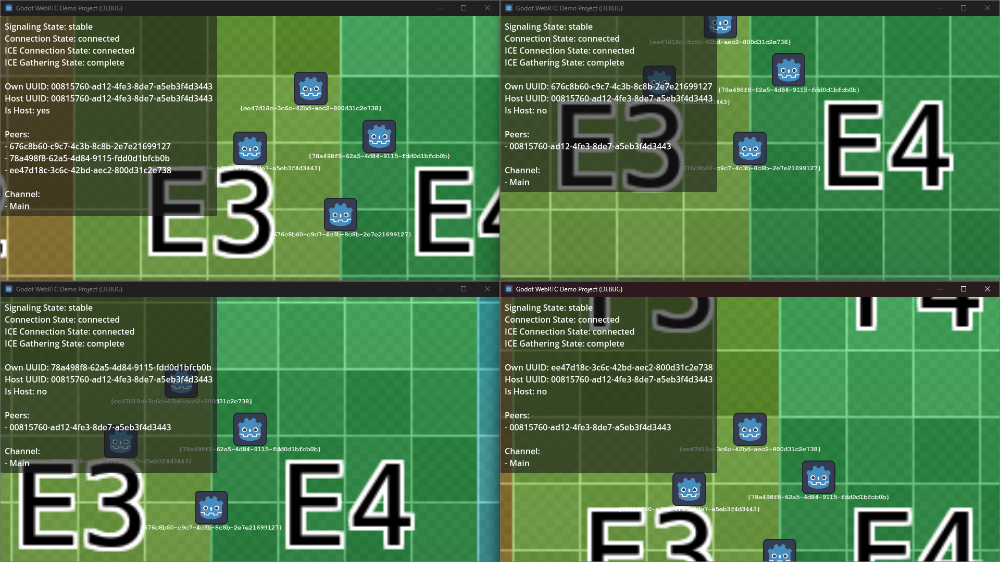

# Demo: Game

The game demo is the most complex demo we currently have.  
Multiple peers can connect to the same game session and will be spawned as a controllable character inside the game world.

## Classes

Due to the complexity of this demo (and scalability in the future!), multiple classes are required this time.  
There are two types of classes we are utilizing:

1. Godot related classes such as `Game.cs` and `Player.cs`.  
   These classes are directly used and interacted with by Godot.

1. Network related classes such as `GamePacket.cs`.
   These classes are used by `Game.cs` and `Player.cs`, but not Godot directly.

### Godot related classes

First, let's look at the Godot classes (`Game.cs` and `Player.cs`).  
Most of these classes should be straight forward, but there are some helper methods like `SendGamePacketToHost`.
We could strip those methods out, but it's making our networking code easier to read and produces less errors due to less confusion.

Of note here is that the `Game.cs` is the same class no matter if the peer is a host or client.
This is true for all the demos actually.
However, depending on if we are in "host mode" or "client mode", it will behave differently.

For example: **Only** the host will spawn in players.
Upon a new connection being made, the host will spawn the player and then inform the newly connected peer about any other players.
All other peers will also receive a player packet, which then will spawn them locally.

Another example is the player inputs:  
Any inputs player do are send to the host.  
This will prevent players from being able to cheat as they cannot _set their position_, but only communicate their _clamped input vectors_.
The host then actually moves the player and sends a player packet to each client.
Each client then can set the players position (including their own!).  
However, due to latency and possible lag, this process isn't instant.
Thus, client-side prediction of the given movement is done.

> This isn't perfect yet and a bit jittery at times, but works.  
> Further work may be required. If you know how to: Open an issue/PR! ❤️

`Player.cs` also defines signals to have `Game.cs` interface with it and listen for changes in position and input vectors!

### Network related classes

Next, the network related packages are simply that: Classes to make networking easier.  
Unlike the other demos, a game is much more complex to code and handle.
Thus, we need a protocol to identify each packet and figure out what to do with the data.

The `GamePacket.cs` is the base network packet we are using.  
It has two properties:

1. The _Type_ of game packet this is. This is `GamePacketType.cs`.
2. A JSON encoded string containing an inner packet.  
   This inner value holds a `GamePacketPlayer.cs` or `GamePacketInput.cs`, encoded as JSON.

> ![NOTE]  
> Unfortunately, that means we have to encode and decode a packet _twice_.  
> Once, the packet itself (inner), once the `GamePacket.cs` itself.
>
> As an alternative to this, we could create two channels.
> One for `Player` packets, one for `Input` packets.  
> Assuming everything is correctly send, we will always know what _kind of packet_ to expect and thus can easily just parse that!

A `Player` packet contains two fields:

1. A player UUID
2. A player position

Each client simply checks first if a player with that UUID exists and if not, it creates one.  
Then, the player location is set.

A `Input` packet contains just one field:

1. The input vector

The host clamps this value, then applies it to the peer player.
