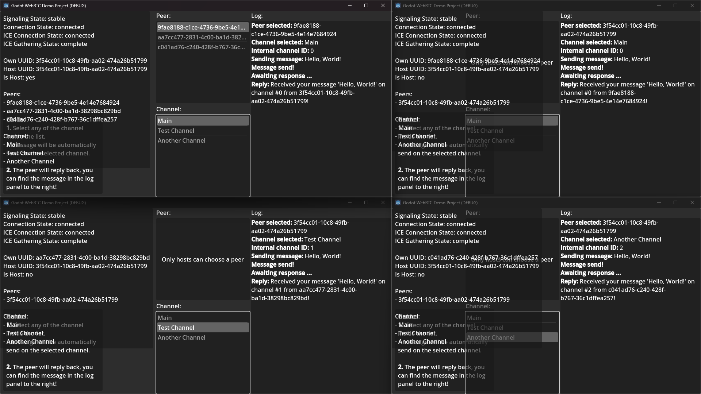

# Demo: Multi Channel

The Multi Channel demo utilizes multiple channels to send messages between a host and clients.

## Flow

> [!NOTE]  
> The interesting peer here is the **host**.

Both clients initialize and send a request packet to the Match Maker server.  
Once the room is filled, a connection is established between host and clients.

As soon as a connection is made, multiple channels will be opened.  
We don't properly utilize the additional channels, but show how they work:

1. Sending messages on a specific channel is as easy as changing the `channelId` field when calling functions like `SendOnChannel`.  
   `0` always corresponds to the default "Main" channel, other channels can be added as needed.
1. Receiving messages from a specific channel is equally easy: The `OnMessage` events will be the same, but the `channelId` can be utilized to figure out from which channel the message came.

Now that multiple channels are open, the host can select a peer (any of the clients) and a channel to send a message on.
The app then automatically sends a message to the selected peer on the selected channel.
Upon receiving the message, the client will respond with a message stating what the message was and where it came from.

Clients can also select a channel to do the same.  
However, since clients always only have one connection to the host and never to other peers, only the host peer is available.

## How is this useful?

This demo may seem useless as it only shows the minimal usage of using multiple channels without actually utilizing them for anything meaningful. However, it serves to illustrate some important points:

- How to send messages on channels
- How to receive messages from channels

There are multiple ways you can utilize channels.  
For example:

- Instead of having a protocol that defines something like a `PacketType` (similar to how we are doing it inside the Match Maker packets), one could define many channels for each type of packet. The `channelId` will define which packet to be expected. This would drastically improve the need for parsing packets multiple times or coming up with some up-front protocol.
- Channels can be divided by logical areas or game systems. For example one channel for player movement, one for player input, one for UI updates, one for match state updates.
- Channels can be given a specific purpose like one for Chats, one for Video data, one for Audio data.

As far as I am aware, using multiple channels doesn't have any advantages or disadvantages when it comes to speed and transmission rate.  
However, they are mainly used to speed up parsing of packets on the receiving end and to logically separate different types of data being sent.
