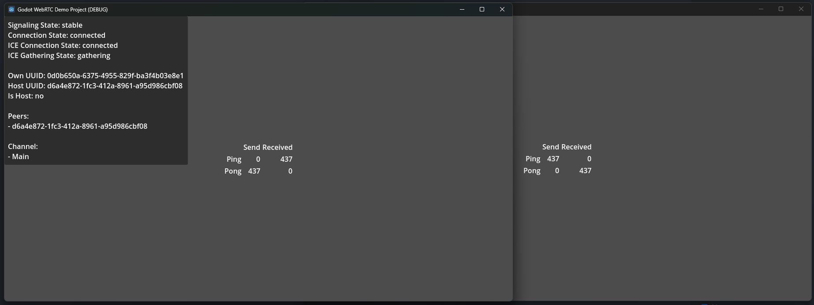

# Demo: Ping Pong

The Ping-Pong demo is a very simple demo.  
It showcases a minimal example of using the provided plugins to send and receive messages between a host and client.

## Flow

Both clients initialize and send a request packet to the Match Maker server.  
Once the room is filled, a connection is established between host and clients.

As soon as a channel opens we can start sending data.  
A channel opens once both peers are fully connected and at least the given channel (usually "Main"/0) is ready for sending and receiving data.

In this demo, a host always initiates the flow by sending a simple message ("Ping!") to the client over the opened channel. Upon receiving this message, each client responds by sending a reply message ("Pong!") back to the host.  
Additionally, counters keep track of how many pings and pongs got send and received.  
This is fully optional of course and just for visualisation.

> [!NOTE]  
> A host only ever **sends** "Ping!" messages and only ever **receives** "Pong!" messages.
> Thus, only those two counters will increase.  
> Similarly, the opposite is true for clients.
> Clients always **send** "Pong!" as a response to incoming "Ping!" messages.
