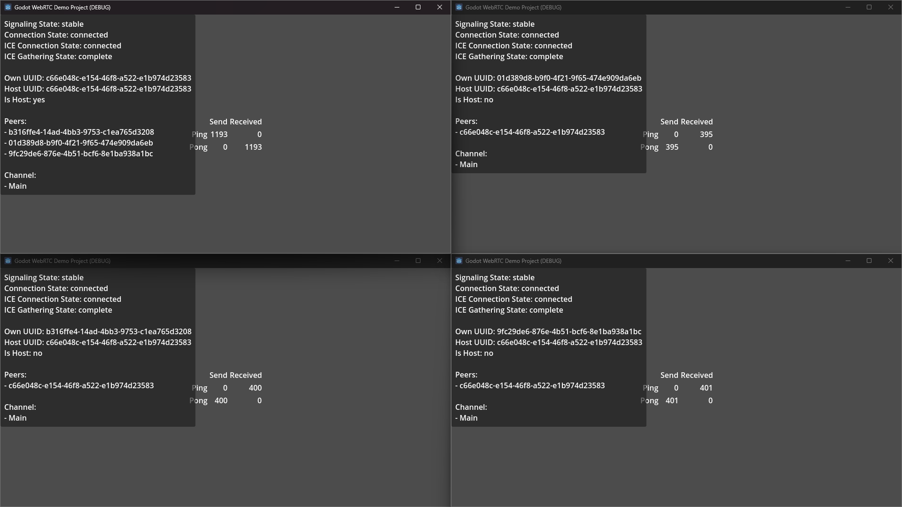

# Demo: Ping Pong

The Ping-Pong demo is the most simple demo we currently have.

A host sends a "Ping!" to each client.  
Each client receives that message and replies with "Pong!".  
That's it. While this is happening there are four counters (two per message) being incremented to show a state change.

## Details

A host only ever sends "Ping!" messages and only ever receives "Pong!" messages.  
Thus, only the "Send-Ping" and "Receive-Pong" counters should be incrementing, while the other two counters stay at 0.

A client only ever sends "Pong!" messages and only ever receives "Ping!" messages.  
Thus, only the "Send-Pong" and "Receive-Ping" counters should be incrementing, while the other two counters stay at 0.
