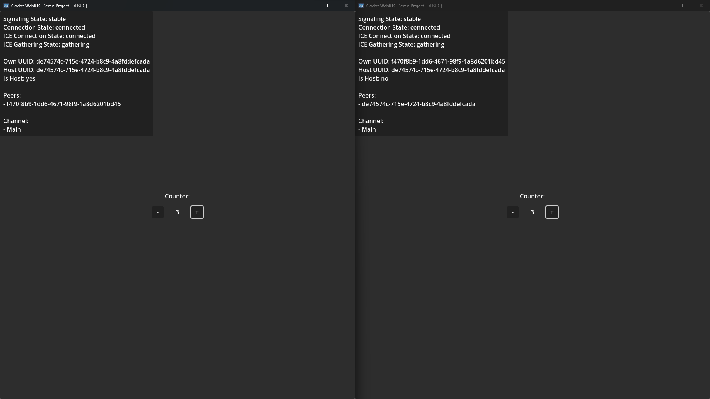

# Demo: RPC

The RPC demo utilizes Godot's internal networking to make RPC (remote procedure calls; Calling a function remotely over a network).  
This also allows for using Godot's [MultiplayerSpawner](https://docs.godotengine.org/en/stable/classes/class_multiplayerspawner.html) and [MultiplayerSynchronizer](https://docs.godotengine.org/en/stable/classes/class_multiplayersynchronizer.html).  
The demo initial was showing this off, but there seems to be some issue since Godot 4.0 with setting the multiplayer authority correctly.

When starting the demo, there is a simple counter and two buttons on screen.  
Each peer can press the buttons.
One button adds to the counter (+), the other one subtracts from the counter (-).  
Once a button is pressed, the client will read the current counter, modify it, then call the update label function via RPC.
The update label function is called both locally and remotely.
Thus, both peers are updated.

