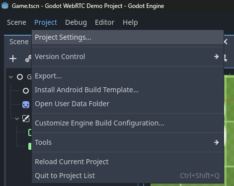
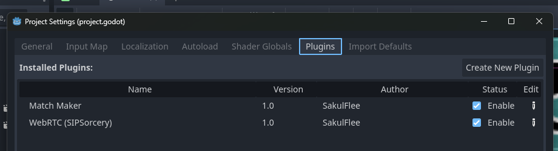

# Further Godot setup

Now, that we have a project setup, you **must** hit the _Build_ button inside Godot **at least once**.
Godot needs to compile the plugin(s) before we are able to activate them!  
Once the build succeeded head to the top left corner and go to:  
`Project -> Project Settings -> Plugins` (tab atop)  
Then **Enable** the _"WebRTC (SIPSorcery)"_ plugin (and _"Match Maker"_ if needed).




That's it! 🎉  
You should now be able to use this project.

To continue either check [below](#matchmaker-scene-setup) or continue with the [Match Maker getting started guide](../Match%20Maker/GettingStartedWithMatchMaker.md).

## MatchMaker scene setup

If you don't have a scene with the `MatchMaker` node yet, create a new scene, or use an existing scene, and add a `MatchMaker` node!

Once the `MatchMaker` node is added to your scene check the Inspector panel and set the `Match Maker Connection String`.
We will set this up during the [Getting started with Match Maker](../Match%20Maker/GettingStartedWithMatchMaker.md) guide.  
**Remember to come back here**!

> The connection string is expected to be in the following format:  
> ws://[ip address or domain]:[port]
>
> If you host the server locally (see below), it would be:  
> ws://127.0.0.1:33333

Lastly, you will need to interface with the `MatchMaker`.  
To do so: Add a script to your scene and get the `MatchMaker` node.
Then, use `MatchMaker::SendRequest` with a `MatchMakerRequest` to send a request to the server.  
An example implementation in C# may look like this:


```csharp
// Main.cs
using Godot;

public partial class Multiplayer : Node
{
    private MatchMaker matchMaker;
    private bool requestSend = false;

    public override void _Ready()
    {
        // (1)
        matchMaker = GetNode<MatchMaker>("MatchMaker");
    }

    public override void _Process(double delta)
    {
        // (2+3)
        if (!requestSend && matchMaker.IsReady())
        {
            // (4)
            var error = matchMaker.SendRequest(new MatchMakerRequest()
            {
                name = "Test",
            });
            // (5)
            requestSend = error == Error.Ok;
        }
    }
}
```

The above will do:

1. Get the node `MatchMaker` we added to the scene tree
2. If we haven't send a request yet:
3. Check if the `MatchMaker` is ready, if so:
4. Attempt sending our request (`MatchMakerRequest`)
5. Check for the `Error`. If it failed to send the procedure is repeated. Otherwise, mark the request as send.
