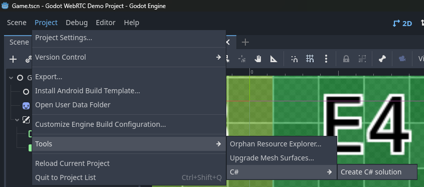

# Getting started with a fresh or existing project

Adding this project to an existing or fresh Godot project can be easily done.  
However, there are some requirements.
Follow this guide closely to avoid mistakes.

First of all, make sure your project is "C# _enabled_".  
This will require you to have the C#/Mono version of Godot.  
If your project isn't using C# yet, open the project in Godot in the top left corner go to  
`Project -> Tools -> C# -> Create C# solution`.



Next, you will need to acquire the plugins for your needs.  
You will at least require the WebRTC plugin, but if you want to use the _Match Maker Server_ you will also need the plugin for it.

You have multiple options on how to add this to your project:

- via Asset Library ([WebRTC plugin](https://godotengine.org/asset-library/asset/2394) | [Match Maker Server](https://godotengine.org/asset-library/asset/2398))
- via downloading a [Release](releases/)
- via cloning this Repository
- via downloading a ZIP from this repository
- ... and possibly more ...

Chose whatever fits your use-case the best.  
The important part is that [Godot] expects the files under `/addons/**/*`.

Secondly, you will have to install the .NET library `SIPSorcery`.  
If you are using dotnet core, it can be easily done like so:

```bash
dotnet add package SIPSorcery
```

Now, everything should be prepared.  
To continue this guide, go to [further Godot setup](./FurtherGodotSetup.md).
