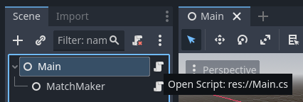

# MPDungeon WebRTC

Clone instructions:

```bash
git clone git@github.com:SakulFlee/MPDungeonWebRTC.git
cd MPDungeonWebRTC
git remote add upstream git@github.com:SakulFlee/Godot-WebRTC-Match-Maker.git
```

[](https://godotengine.org)
[](https://www.rust-lang.org/)
[](https://www.rust-lang.org/)
[](https://webrtc.org)

>⚠️⚠️⚠️  
>
> As of writing this there is an issue with Godot 4.x and C# when using the [WebRTC-Plugin for Godot].
> There is a fix for this in the making [godotengine/webrtc-native#116](https://github.com/godotengine/webrtc-native/issues/116) & [godotengine/godot#pr-84947](https://github.com/godotengine/godot/pull/84947).
> However, as of writing this, this change has not been integrated into Godot yet.
>
> We currently provide a workaround using GDScript to get around this limitation.  
> In a future version this will be fixed and easier to work with.

This repository holds two projects:

- A Match Maker server, used for connecting clients and hosts via [WebRTC] and acting as a Queue
- A Godot module to interface and integrate the Match Maker, while also connecting everyone via [WebRTC] and the official [WebRTC-Plugin for Godot].

> Note:  
> While this project is made for Godot, it can be used in any other Engine and Project.
> Small alterations need to be made of course.  
> Read through [How does this work?](#how-does-this-work) and [Usage in non-Godot projects](#usage-in-non-godot-projects) to learn how to.

## How to use this?

Using this project is intended to be simple, but involves two, in some cases three, parts.  
The following sections will go over each step.

### Setting up Godot

First, setup a new project in Godot (or use an existing one).  
**Make sure to use the .NET version of Godot and are creating a .NET project.**

Next, Install the [WebRTC-Plugin for Godot] into your project.  
Either follow the instructions on GitHub, or install via the Asset Library.

Next, head to [releases](releases/) and download the current version of the "Godot Module" and extract it.
Alternatively, checkout the repository and copy everything under [Godot Module](/Godot%20Module/) into your project.  

> The file structure must not be kept as-is

Build the project at least once to get access to the _Global Classes/Custom Nodes_ for `MatchMaker` and `WebRTCConnection`.

Make a new scene, or use an existing one, and add the `MatchMaker` node to it.  
If, for some reason, the class does not show up in the Node selector try rebuilding the project and reopening Godot.

Once the `MatchMaker` node is added to your scene check the Inspector panel and set the `Match Maker Connection String`.
We will set this up in the next section, **remember to come back here**!

> The connection string is expected to be in the following format:  
> ws://[ip address or domain]:[port]  
>
> If you host the server locally (see below), it would be:  
> ws://127.0.0.1:33333

Lastly, you will need to interface with the `MatchMaker`.  
To do so: Add a script to your scene and get the `MatchMaker` node.
Then, use `MatchMaker::SendRequest` with a `MatchMakerRequest` to send a request to the server.  
An example implementation in C# may look like this:



```csharp
// Main.cs
using Godot;

public partial class Multiplayer : Node
{
    private MatchMaker matchMaker;
    private bool requestSend = false;

    public override void _Ready()
    {
        matchMaker = GetNode<MatchMaker>("MatchMaker");
    }

    public override void _Process(double delta)
    {
        if (!requestSend && matchMaker.IsReady())
        {
            var error = matchMaker.SendRequest(new MatchMakingRequest()
            {
                name = "Test",
            });
            requestSend = error == Error.Ok;
        }
    }
}
```

The above will do:

1. Get the node `MatchMaker` we added to the scene tree
2. If we haven't send a request yet:
3. Check if the `MatchMaker` is ready, if so:
4. Attempt sending our request (`MatchMakingRequest`)
5. Check for the `Error`. If it failed to send the procedure is repeated. Otherwise, mark the request as send.

### Setting up the Match Maker Server

Make sure [Rust] is installed.
If it isn't installed, ideally use [RustUp].

Checkout the repository and go into the _Match Maker Server_ directory.

Now, build the project with:

```bash
cargo build --release
```

> Make sure to include the release flag!

You'll find the server binary under `Match Maker Server/target/release/match_maker_server(.exe)`.

Alternatively, you can use the following to directly build and run the project:

```bash
cargo run --release
```

> Make sure to include the release flag!

The server should be running now!  
Head back to your Godot project and add the connection string.

If the server is running locally on the same device add `ws://127.0.0.1:33333` as the connection string.

However, at least for released games, it is highly recommended to actually host this server somewhere.  
As a quick and free server you can check out [Oracle Cloud Free-Tier].  
Simply follow the same steps of installing [Rust], compiling as release and run it.

### TURN Server (Optional)

Lastly, sometimes WebRTC **fails to establish a direct connection** between peers.  
In such situations a **relay** is needed.
That's what a TURN server is effectively.  
If you want, or need, peers to almost always connect successfully, you will need a TURN server.

You can basically use **any** TURN server, however I've had great success with [CoTURN].
Thus, my personal recommendation is to host your own [CoTURN] server.
This can be done on the same server as the Match Maker!

TODO: How to set this in Godot?

## How does this work?

The principle of this project is pretty simple.  
There are more details hidden, but let's focus on the important bits:

> We differentiate between `clients` ("joins a game") and `hosts` ("hosts a game").  
> Both are named `peer` here.

First, a peer connects to the Match Maker via a WebSocket.  
Once a connection is opened, the peer will send a `MatchMakingRequest` to the server.

This `MatchMakingRequest` contains some basic information about the game.
Such as, what map/level/scene is being attempted to play.

The peer now waits until the room is full.  
In the meantime, another peer connects, following the same procedure, and fills the room.

Both clients now receive a `MatchMakingResponse`.  
This response includes whether the given peer is assigned as a Host (typically the first to create/join the room) or a Client, as well as a list of peers to connect to.

Each peer now initializes the [WebRTC] backend.  
This includes creating and setting a local session.

The client now sends their session description to the host via the Match Making server.  
Once received, the host sets this session description as the remote session and creates an offer.

In the process of creating offers, ICE Candidates will be generated.  
These candidates will be send to the client, once again via the Match Making server.

Once this succeeded, both peers should be able to connect to each other.

Here is a _simplified_ overview:


## Usage in non-Godot projects

> Read through [How does this work?](#how-does-this-work) first!

Effectively, you will have to build your own WebRTC host/client based on the provided protocol.
As a starting point, take a look at the existing Godot implementation (#TODO: Add link here).

Start by finding a WebRTC library for your programming language and/or Engine.  
[Here is a list to get you started.](https://github.com/topics/webrtc-libraries)

You also will need a JSON serializer/deserializer as the protocol is based on JSON.

Follow the existing implementation in Godot:

1. Open a WebSocket connection to the Match Making server
2. Send a `MatchMakingRequest`
3. Wait for `MatchMakingResponse`
4. Initialize WebRTC part
5. Share session descriptions with peer
6. If host: Create offer
7. Share ICE Candidates
8. Assure peers are connected

[WebRTC]: https://webrtc.org/
[WebRTC-Plugin for Godot]: https://github.com/godotengine/webrtc-native
[Rust]: https://www.rust-lang.org/
[RustUp]: https://rustup.rs/
[Oracle Cloud Free-Tier]: https://www.oracle.com/cloud/free/
[Coturn]: https://github.com/coturn/coturn
