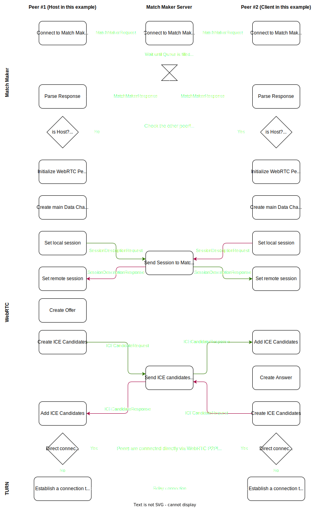

# Godot WebRTC Match Maker | WebRTC P2P Match Maker for Godot

  

- [Godot WebRTC Match Maker | WebRTC P2P Match Maker for Godot](#godot-webrtc-match-maker--webrtc-p2p-match-maker-for-godot)
  - [What is this?](#what-is-this)
  - [Platform support](#platform-support)
  - [Getting started](#getting-started)
  - [How does the Match Making work?](#how-does-the-match-making-work)
  - [Security](#security)
    - [The problem](#the-problem)
    - [The solution](#the-solution)
  - [Contributing](#contributing)
  - [License](#license)

## What is this?

This repository holds two projects which work together to enable P2P (peer-to-peer) connectivity between two or more peers utilizing [WebRTC].
This plugin always tries to establish a direct connection between peers (i.e. no server required to actually run the game / one peer is the host).
However, this is not always possible.
In such cases, a [TURN] server can be utilized to act as a relay between peers.

The first project is _[WebRTC] plugin for [Godot]_.  
This plugin alone enables the usage of P2P connections between peers.  
In theory, you can make your own backend (so called "Signaling Server") to share the required information between peers such as _ICE Candidates_ and _Session Descriptions_.

The second project is the _Match Maker Server_.  
It is a minimal signaling server utilizing _WebSockets_ for communication.
This server does exactly two things:

1. Match peers together that requested to join the same room.  
   Upon a room being filled up, each peer is informed about the other peers to connect to and if they are a host or not.

2. Once a room filled and the initial information got shared across all peers, this server will act as a relay to share _ICE Candidates_ and _Session Descriptions_ with every peer.

This _Match Maker_ can be used separately from Godot (i.e. any application wanting to utilize WebRTC and is in need for some simple match making can utilize this!).  
However, it's main use is intended to be in Godot with the second plugin: _Match Maker for Godot_.

A Godot application may connect to this server utilizing WebSockets.
It utilizes WebSockets for Client (Game / Godot) to Server communication.
This server will be utilized for _Match Making_ and as a peer relay.

Additionally, an example project exists with multiple demos that can be trialed and build upon.  
Currently, the available demos are:

| Demo Name     | Short Description                                                                 | Detailed Description                            |
| ------------- | --------------------------------------------------------------------------------- | ----------------------------------------------- |
| Ping-Pong     | The most simple demo. Sends "Pings!" and "Pongs!" back and forth and counts them. | [link](./Godot%20Project/Demos/PingPong.md)     |
| Chat          | A (very basic) chat demo.                                                         | [link](./Godot%20Project/Demos/Chat.md)         |
| Multi-Channel | Shows example usage of multiple channels.                                         | [link](./Godot%20Project/Demos/MultiChannel.md) |
| Game          | An actual game where sprites can move around the screen freely.                   | [link](./Godot%20Project/Demos/Game.md)         |

## Platform support

| Platform |     | Status              | Comment                                                                                                                                                                                                                                                                                                                                                                         |
| -------- | --- | ------------------- | ------------------------------------------------------------------------------------------------------------------------------------------------------------------------------------------------------------------------------------------------------------------------------------------------------------------------------------------------------------------------------- |
| Windows  | ✅  | Fully supported     | Should work without further setup                                                                                                                                                                                                                                                                                                                                               |
| Linux    | ✅  | Fully supported     | Should work without further setup                                                                                                                                                                                                                                                                                                                                               |
| macOS    | ✅  | Fully supported     | Should work without further setup, but may not be tested                                                                                                                                                                                                                                                                                                                        |
| Android  | ⚠️  | Partially supported | Works sometimes, on some platforms, but not all demos fully work. More testing is required as of now. [Tracker: [#106](https://github.com/SakulFlee/Godot-WebRTC-Match-Maker/issues/106)]                                                                                                                                                                                       |
| iOS      | ❓  | Unknown             | iOS testing requires a macOS device, Apple developer license and XCode with an iOS Simulator _or_ actual iPhone/iPad. I have neither in my possession and don't really want to waste money. If anyone is able to test this please do and inform me about it (even if it's fully working!) [Tracker: [[#107](https://github.com/SakulFlee/Godot-WebRTC-Match-Maker/issues/107)]] |
| Web      | ❌  | Unsupported         | Godot currently doesn't export C# projects to the Web. Once this is possible, we can do further testing and possibly add support for it. [Tracker: [[#108](https://github.com/SakulFlee/Godot-WebRTC-Match-Maker/issues/108)]]                                                                                                                                                  |

## Getting started

The following section will guide you through how to get started with this project.
Click on any link to start the guide.

There are two components you will need to use this project:

Firstly, a _Godot Project_ with, ideally, both plugins installed.
You can either start with our included demo project, or, start with a fresh or existing project:

- [Getting started with fresh or existing project](./Documentation/Godot/GettingStartedWithAFreshProject.md)
- [Getting started with demo project](./Documentation/Godot/GettingStartedWithDemoProject.md)

Secondly, you will need a signaling server, ideally, the _Match Maker Server_.

- [Getting started Match Maker Server](./Documentation/Match%20Maker/GettingStartedWithMatchMaker.md)

## How does the Match Making work?

Each peer connects to the _Match Maker Server_ which acts first as a _lobby server_.  
Upon connecting, each peer tells the server what room they want to join on (`MatchMakerRequest`).  
The server will look up the specified room and will inform the peer about how many peers are currently in queue for this room (`MatchMakerUpdate`).

Multiple peers can connect and specify different rooms or the same room.  
Each time, any peer in the specified room will be updates about players joining the queue for a room (`MatchMakerUpdate`).

Once a room is full, each peer will receive a `MatchMakerResponse` package.  
This packet includes:

- The peer's own UUID
- The host's UUID
- Any other peer's UUID

With this information, each peer can check if they are a host or client.  
The host will _host the game_, while each client will _join the game_.

Each peer now will initialize one or multiple [WebRTC] nodes inside Godot.  
These nodes handle everything related to [WebRTC] and the P2P communication.

If a peer is a host, multiple such nodes will be spawned (one for each client).  
If a peer is a client, a single node will be spawned (one for one host).

Once the [WebRTC] nodes are fully initialized, they will create a _Session Description_.  
A _Session Description_ is a two parted packet, including a lot of information about each peer.  
This must be set locally (as "local session description") **and** remotely on the other peer (asa "remote session description").  
To set this remotely, the _Match Maker server_ will be utilized as a relay between peers until a connection is established.

Once both a local and remote _Session Description_ is set, each node begins contacting a [STUN] or [TURN] server and gather _ICE Candidates_.  
An _ICE Candidate_ defines a possible connection to the local peer.
Thus, it includes information such as an IP address, port to use and in some cases a relay ([TURN] server) address.  
This information has to be shared with the corresponding remote peer.  
To achieve this, the _Match Maker server_ is once again used as a relay to share this information.

As soon as at least one ICE candidate is set, the nodes will begin trying to connect to each other.  
There is a priority system in-place which will, if possible, always prefer a local direct connection over a relay ([TURN]) connection.  
At this point, each peer should connect momentarily.

Here is a visual overview between two peers (one host, one client) and both a direct and a relay ([TURN]) connection:

## Security

The following security concern is true for any P2P connections.
This includes protocols like BitTorrent, but also [WebRTC]!

Please read the following carefully and decide if this will be an issue for you or not.
Furthermore, potential solutions and workarounds are provided.

### The problem

P2P connections of any kind have a big issue when it comes to privacy:
To establish a **direct P2P** connection, each peer needs to know the others IP address (and port).  
Thus, effectively leaking the peers IP address to another peer.
This can enable hackers to target peers directly once they know the IP address with e.g. DDoS attacks and worse.

Inside the Match Maker, we try to anonymise this information as best as possible.
Each peer gets a UUID assigned (also referred to us by `Peer UUID`).
When a packet is send to some peer, it always is addressed to this peer UUID, not an IP address.
However, [WebRTC] still **needs** to know the IP address of the peer it wants to connect to for direct connections.  
Think about it: How would [WebRTC] connect somewhere without knowing where to connect to?
That's like trying to send a letter to an unknown address.

Our plugins don't expose this information (mainly IP address) at all, but _Session Descriptions_ and _ICE Candidates_ **cannot** be changed or hidden, as they contain the technical details needed for [WebRTC] to establish a direct connection.
Any information stripped or mangled would also make a connection impossible.

> ![NOTE]  
> Even though we don't expose this information, someone could still use either a hacked game client or simply a packet sniffer like [WireShark](https://www.wireshark.org/) to filter out these network packages and extract the IP addresses.
> That'll be more effort to get the information ofc, but if someone actually wants the information it would be easy to get.

### The solution

Now, first of all we will have to decide on whether this security issue actually is an issue for us.
If you only intend to have some local network multiplayer (e.g. "in-house co-op"), you likely won't have an issue with this at all.
Home networks are usually pretty permissive and with minimal effort you can already figure out all IP addresses in the network.
Unless you have a _hacker_ in your basement, this won't be a problem.

Next, you could very well introduce a kind of pop-up warning in your game that warns players about potential dangers and advises them to only play with trusted people/friends.
However, the current Match Maker server doesn't really allow for this as _any_ peer will be matched, no matter if you trust them or even know the other peer.  
**I highly advise to not use this approach as it basically just puts blame and choice on the players of your game.**

Lastly, the probably best solution: Utilize a relay!  
That's exactly what a [TURN] server is for.
It acts as a middleman, hiding the real IP addresses of peers from each other.
The only issue with this is that you will have to host a [TURN] server yourself.  
Google (as an example, used by the plugins!) has a public available [STUN] server collection, but no [TURN] servers.  
We already have a guide for setting up a [TURN] server which has some hosting suggestions: [Match Maker - Better Connectivity](./Documentation/Match%20Maker/GettingStartedWithMatchMaker.md#better-connectivity)

Alternatively, although arguably more work, you could ship a given [TURN] server _with_ your game and let users **host it locally**.
You would have to auto-configure the [TURN] server properly, handle it in the background, etc. and most importantly advise the user to open a port in their router or hope on something like [UPnP](https://en.wikipedia.org/wiki/Universal_Plug_and_Play) to be activated.  
One player would host the game then, acting as a [TURN] server for the other clients.
Everyone else would connect to their [TURN] server.  
This would hide the IP addresses of all peers from each other while still allowing direct connections through the [TURN] server.
However, the host **could** find the IP addresses of everyone.
Meaning, this is once again a "trusted/friends only" solution.

## Contributing

Any kind of contributions are more than welcome!  
Please open [issues](issues/), for bugs and feature requests, and, [PRs](pulls/) for changed being made.

Please try to keep the quality standard up.  
_[PRs](pulls/) may be rejected due to poor code quality \_or_ subjected for further work needed.\_

If you end up porting this to another Engine, Framework or Project, please open an [issue](issues/) to merge it into this repository for everyone.
Alternatively, we could link to your repository, however merging would be highly appreciated!

## License

This repository is licensed under the MIT License.
This includes all plugins, the demo project and any demos included into it.

However, if you end up making any changes to this which may be useful for others, I highly would encourage opening a [PR](pulls/) and merging it into this repository.  
[Contributions](#contributing) are more than welcome!

[WebRTC]: https://webrtc.org/
[Godot]: https://godotengine.org/
[STUN]: https://en.wikipedia.org/wiki/STUN
[TURN]: https://en.wikipedia.org/wiki/Traversal_Using_Relays_around_NAT
