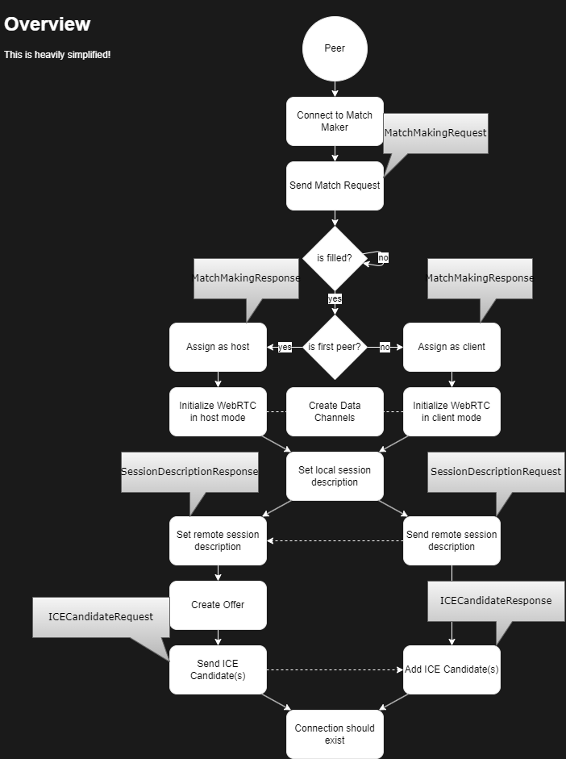

# Godot WebRTC Match Maker

>⚠️⚠️⚠️  
>
> As of writing this there is an issue with Godot 4.x and C# when using the [WebRTC-Plugin for Godot].
> There is a fix for this in the making [godotengine/webrtc-native#116](https://github.com/godotengine/webrtc-native/issues/116) & [godotengine/godot#pr-84947](https://github.com/godotengine/godot/pull/84947).
> However, as of writing this, this change has not been integrated into Godot yet.
>
> We currently provide a workaround using GDScript to get around this limitation.  
> In a future version this will be fixed and easier to work with.

This repository holds two projects:

- A Match Maker server, used for connecting clients and hosts via [WebRTC] and acting as a Queue
- A Godot module to interface and integrate the Match Maker, while also connecting everyone via [WebRTC] and the official [WebRTC-Plugin for Godot].

> Note:  
> While this project is made for Godot, it can be used in any other Engine and Project.
> Small alterations need to be made of course.  
> Read through [How does this work?](#how-does-this-work) and [Usage in non-Godot projects](#usage-in-non-godot-projects) to learn how to.

## How does this work?

The principle of this project is pretty simple.  
There are more details hidden, but let's focus on the important bits:

> We differentiate between `clients` ("joins a game") and `hosts` ("hosts a game").  
> Both are named `peer` here.

First, a peer connects to the Match Maker via a WebSocket.  
Once a connection is opened, the peer will send a `MatchMakingRequest` to the server.

This `MatchMakingRequest` contains some basic information about the game.
Such as, what map/level/scene is being attempted to play.

The peer now waits until the room is full.  
In the meantime, another peer connects, following the same procedure, and fills the room.

Both clients now receive a `MatchMakingResponse`.  
This response includes whether the given peer is assigned as a Host (typically the first to create/join the room) or a Client, as well as a list of peers to connect to.

Each peer now initializes the [WebRTC] backend.  
This includes creating and setting a local session.

The client now sends their session description to the host via the Match Making server.  
Once received, the host sets this session description as the remote session and creates an offer.

In the process of creating offers, ICE Candidates will be generated.  
These candidates will be send to the client, once again via the Match Making server.

Once this succeeded, both peers should be able to connect to each other.

Here is a _simplified_ overview:

## Usage in non-Godot projects

> Read through [How does this work?](#how-does-this-work) first!

Effectively, you will have to build your own WebRTC host/client based on the provided protocol.
As a starting point, take a look at the existing Godot implementation (#TODO: Add link here).

Start by finding a WebRTC library for your programming language and/or Engine.  
[Here is a list to get you started.](https://github.com/topics/webrtc-libraries)

You also will need a JSON serializer/deserializer as the protocol is based on JSON.

Follow the existing implementation in Godot:

1. Open a WebSocket connection to the Match Making server
2. Send a `MatchMakingRequest`
3. Wait for `MatchMakingResponse`
4. Initialize WebRTC part
5. Share session descriptions with peer
6. If host: Create offer
7. Share ICE Candidates
8. Assure peers are connected

[WebRTC]: https://webrtc.org/
[WebRTC-Plugin for Godot]:(https://github.com/godotengine/webrtc-native)
